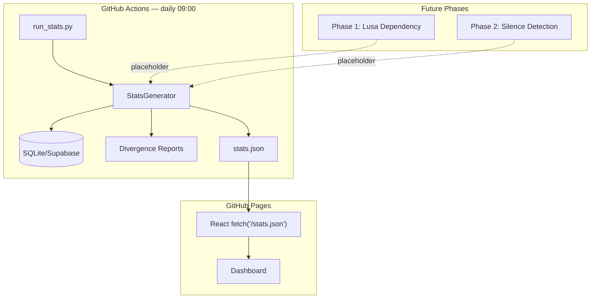

# Estatísticas Vespeiro — Design Document

> **Portal Estatístico e API de Métricas Internas**
> *Parte do Projecto Vespeiro — 27 de Maio de 2026*

---

## Table of Contents

1. [Problem & Motivation](#1-problem--motivation)
2. [Architecture Overview](#2-architecture-overview)
3. [Data Schema](#3-data-schema)
4. [Component Design](#4-component-design)
5. [Pipeline Integration](#5-pipeline-integration)
6. [Edge Cases & Error Handling](#6-edge-cases--error-handling)
7. [Testing Strategy](#7-testing-strategy)
8. [Dependencies & Timeline](#8-dependencies--timeline)

---

## 1. Problem & Motivation

### The Problem

O Vespeiro gera métricas ricas — divergência narrativa, dependência da Lusa, silêncios na cobertura internacional — mas não existe um **ponto único** onde todos esses números estão consolidados para consumo.

Atualmente:
- `DivergenceReport` → guardado na DB, mas sem agregação
- Contagens de artigos → espalhadas por tabelas SQL
- Dependência Lusa → planeada na Fase 1, mas sem output centralizado
- Silêncio → planeado na Fase 2, sem output centralizado

### O que queremos

Um **Stats Generator** que corre diariamente (via GHA) e produz um único ficheiro `stats.json` com todas as métricas quantificadas da plataforma. Este ficheiro é consumido pelo dashboard React (via `fetch()`) e serve como fonte única de verdade para:

- Números de fontes e artigos (total, hoje, por categoria)
- Percentagem de lead da Lusa por outlet e tópico
- Taxas de descontextualização (divergência) por outlet
- Histórias silenciadas (não cobertas em Portugal)
- Séries temporais de 7 dias para métricas principais
- Estado de saúde do sistema

### Princípios

| Princípio | Porquê |
|-----------|--------|
| **Zero servidores** | JSON estático em GitHub Pages, sem backend running |
| **Atualização diária** | GHA cron às 09:00, sem real-time complexity |
| **Graceful degradation** | Métricas não implementadas → `null`, não crash |
| **Tudo quantificado** | Números concretos, não "sensações" |

---

## 2. Architecture Overview



### File Structure

```
backend/src/stats/
├── __init__.py              # Package init
├── models.py                # Pydantic models for the full stats.json schema
└── generator.py             # StatsGenerator: collects all metrics

backend/run_stats.py         # Entrypoint for GHA

frontend/public/
└── stats.json               # Generated output (committed to repo)
```

### Data Flow

1. **GHA trigger:** `cron: '0 9 * * *'` (daily 09:00)
2. **`run_stats.py`** instancia `StatsGenerator(db_session)`
3. **`StatsGenerator.collect()`** executa:
   - `_source_metrics()` — queries à DB
   - `_lusa_metrics()` — placeholder (Fase 1)
   - `_divergence_metrics()` — lê da tabela analyses
   - `_silence_metrics()` — placeholder (Fase 2)
   - `_timelines()` — 7 dias de histórico
   - `_system_health()` — health checks
4. **Output:** `frontend/public/stats.json`
5. **Deploy:** GHA faz commit + push, ou deploy para GitHub Pages
6. **Consumo:** `React: const stats = await fetch('/stats.json').then(r => r.json())`

---

## 3. Data Schema

### Full stats.json Schema

```json
{
  "generated_at": "2026-05-27T09:00:00Z",
  "version": "1.0",

  "sources": {
    "total": 16,
    "active": 16,
    "articles_total": 45230,
    "articles_today": 1243,
    "articles_per_source": {
      "lusa": 830,
      "publico": 620,
      "observador": 480,
      "expresso": 510,
      "cm_jornal": 720,
      "jn": 390,
      "dn": 340,
      "rtp_noticias": 710,
      "sic_noticias": 410,
      "eco": 280,
      "cnn_portugal": 350,
      "tsf": 190,
      "renascenca": 260,
      "sapo_24": 310,
      "nam": 240,
      "reuters": 0,
      "bbc": 0,
      "guardian": 0
    },
    "per_category": {
      "agency": { "sources": 1, "articles": 14230, "articles_today": 412 },
      "mainstream": { "sources": 11, "articles": 20120, "articles_today": 621 },
      "public_broadcaster": { "sources": 1, "articles": 8920, "articles_today": 210 },
      "international": { "sources": 3, "articles": 1960, "articles_today": 0 }
    }
  },

  "lusa_dependency": {
    "global_pct": 47.3,
    "per_outlet": {
      "publico": { "pct": 61.3, "stories": 142, "lusa_derived": 87 },
      "observador": { "pct": 43.9, "stories": 98, "lusa_derived": 43 },
      "expresso": { "pct": 38.2, "stories": 110, "lusa_derived": 42 },
      "cm_jornal": { "pct": 29.5, "stories": 176, "lusa_derived": 52 },
      "rtp_noticias": { "pct": 75.9, "stories": 203, "lusa_derived": 154 },
      "jn": { "pct": 52.1, "stories": 85, "lusa_derived": 44 },
      "dn": { "pct": 48.5, "stories": 72, "lusa_derived": 35 },
      "sic_noticias": { "pct": 41.2, "stories": 92, "lusa_derived": 38 },
      "eco": { "pct": 22.8, "stories": 56, "lusa_derived": 13 }
    },
    "per_topic": {
      "saude": 87.0,
      "educacao": 82.0,
      "orcamento_estado": 94.0,
      "politica_externa": 71.0,
      "imigracao": 65.0,
      "economia": 52.0,
      "desporto": 12.0,
      "cultura": 18.0,
      "tecnologia": 22.0,
      "internacional": 31.0
    }
  },

  "divergence": {
    "global_avg": 0.42,
    "per_outlet": {
      "publico": { "avg": 0.38, "stories": 142, "avg_omission": 0.35, "avg_quote_fidelity": 0.72 },
      "expresso": { "avg": 0.52, "stories": 98, "avg_omission": 0.48, "avg_quote_fidelity": 0.58 },
      "cm_jornal": { "avg": 0.71, "stories": 176, "avg_omission": 0.65, "avg_quote_fidelity": 0.41 },
      "observador": { "avg": 0.33, "stories": 88, "avg_omission": 0.30, "avg_quote_fidelity": 0.78 },
      "rtp_noticias": { "avg": 0.28, "stories": 165, "avg_omission": 0.25, "avg_quote_fidelity": 0.81 }
    },
    "top_omitted_facts": [
      { "text": "2.3 milhões de euros", "count": 12, "category": "money" },
      { "text": "500 enfermeiros", "count": 8, "category": "number" },
      { "text": "15 de maio de 2026", "count": 7, "category": "date" },
      { "text": "Organização Mundial de Saúde", "count": 6, "category": "org" },
      { "text": "30 por cento", "count": 5, "category": "pct" }
    ]
  },

  "silence": {
    "today": 5,
    "avg_7d": 3.4,
    "top_silenced": [
      {
        "title": "Trump salva 8 mulheres da execução no Irão",
        "international_sources": 7,
        "pt_coverage": 0,
        "gap_pct": 100,
        "sources": ["BBC", "Reuters", "AP", "El País", "The Guardian", "CNN", "NYT"]
      }
    ]
  },

  "timelines": {
    "lusa_dependency_7d": [45.1, 46.8, 47.2, 46.5, 47.0, 47.3, 47.3],
    "divergence_avg_7d": [0.38, 0.42, 0.40, 0.41, 0.43, 0.42, 0.42],
    "articles_daily_7d": [1240, 1180, 1320, 1210, 1150, 1290, 1243],
    "silence_daily_7d": [3, 5, 2, 4, 6, 3, 5],
    "dates_7d": [
      "2026-05-21", "2026-05-22", "2026-05-23",
      "2026-05-24", "2026-05-25", "2026-05-26", "2026-05-27"
    ]
  },

  "system": {
    "uptime_pct": 99.2,
    "sources_healthy": 15,
    "sources_failing": 1,
    "last_scrape": "2026-05-27T08:45:00Z",
    "last_error": null
  }
}
```

### Pydantic Models

```python
# backend/src/stats/models.py

from pydantic import BaseModel
from datetime import datetime


class CategoryStats(BaseModel):
    sources: int
    articles: int
    articles_today: int

class OutletDependency(BaseModel):
    pct: float
    stories: int
    lusa_derived: int

class OutletDivergence(BaseModel):
    avg: float
    stories: int
    avg_omission: float
    avg_quote_fidelity: float

class SilencedStory(BaseModel):
    title: str
    international_sources: int
    pt_coverage: int
    gap_pct: float
    sources: list[str]

class OmittedFact(BaseModel):
    text: str
    count: int
    category: str

class SourceMetrics(BaseModel):
    total: int
    active: int
    articles_total: int
    articles_today: int
    articles_per_source: dict[str, int]
    per_category: dict[str, CategoryStats]

class LusaDependencyMetrics(BaseModel):
    global_pct: float | None = None
    per_outlet: dict[str, OutletDependency] = {}
    per_topic: dict[str, float] = {}

class DivergenceMetrics(BaseModel):
    global_avg: float | None = None
    per_outlet: dict[str, OutletDivergence] = {}
    top_omitted_facts: list[OmittedFact] = []

class SilenceMetrics(BaseModel):
    today: int = 0
    avg_7d: float = 0.0
    top_silenced: list[SilencedStory] = []

class Timelines(BaseModel):
    lusa_dependency_7d: list[float] = []
    divergence_avg_7d: list[float] = []
    articles_daily_7d: list[int] = []
    silence_daily_7d: list[int] = []
    dates_7d: list[str] = []

class SystemMetrics(BaseModel):
    uptime_pct: float = 0.0
    sources_healthy: int = 0
    sources_failing: int = 0
    last_scrape: datetime | None = None
    last_error: str | None = None

class StatsPayload(BaseModel):
    generated_at: datetime
    version: str = "1.0"
    sources: SourceMetrics
    lusa_dependency: LusaDependencyMetrics
    divergence: DivergenceMetrics
    silence: SilenceMetrics
    timelines: Timelines
    system: SystemMetrics
```

---

## 4. Component Design

### 4.1 `models.py` — Data Types

As shown above. Todos os campos têm defaults seguros (listas vazias, `None`, zeros) para evitar crashes quando métricas ainda não estão implementadas.

### 4.2 `generator.py` — Stats Generator

```python
class StatsGenerator:
    """Collects all platform metrics into a single StatsPayload.
    
    Each method is self-contained and returns defaults if the data
    source is unavailable."""

    def __init__(self, db_session):
        self.db = db_session

    def collect(self) -> StatsPayload:
        return StatsPayload(
            generated_at=datetime.now(timezone.utc),
            sources=self._source_metrics(),
            lusa_dependency=self._lusa_metrics(),      # placeholder até Fase 1
            divergence=self._divergence_metrics(),      # lê divergence reports
            silence=self._silence_metrics(),            # placeholder até Fase 2
            timelines=self._timelines(),
            system=self._system_health(),
        )

    def _source_metrics(self) -> SourceMetrics:
        """Queries DB for source/article counts.
        Already implementable — depends only on DB schema."""
        ...

    def _lusa_metrics(self) -> LusaDependencyMetrics:
        """Placeholder — depends on Phase 1 (Lusa Dependency Analyzer).
        Returns empty/default values for now."""
        ...

    def _divergence_metrics(self) -> DivergenceMetrics:
        """Reads from analyses table where type='divergence'.
        Already implementable — depends on DivergenceAnalyzer output."""
        ...

    def _silence_metrics(self) -> SilenceMetrics:
        """Placeholder — depends on Phase 2 (Silence Detector).
        Returns empty/default values for now."""
        ...

    def _timelines(self) -> Timelines:
        """Builds 7-day timelines from stored daily snapshots.
        Already implementable — stores and reads daily snapshots."""
        ...

    def _system_health(self) -> SystemMetrics:
        """Checks source health from crawl_runs table.
        Already implementable — depends only on DB schema."""
        ...
```

#### Method Details

**`_source_metrics()`**
```sql
-- Count total sources
SELECT COUNT(*) FROM sources;

-- Count active sources
SELECT COUNT(*) FROM sources WHERE is_active = 1;

-- Count total articles
SELECT COUNT(*) FROM articles;

-- Count articles today
SELECT COUNT(*) FROM articles WHERE DATE(collected_at) = CURDATE();

-- Count per source
SELECT source_id, COUNT(*) FROM articles GROUP BY source_id;

-- Count per category
SELECT s.category, COUNT(s.id), COUNT(a.id), COUNT(CASE WHEN DATE(a.collected_at) = CURDATE() THEN 1 END)
FROM sources s LEFT JOIN articles a ON s.id = a.source_id
GROUP BY s.category;
```

**`_divergence_metrics()`**
```python
def _divergence_metrics(self) -> DivergenceMetrics:
    reports = self._load_divergence_reports()
    if not reports:
        return DivergenceMetrics()

    per_outlet = {}
    for r in reports:
        outlet = r.portuguese_outlet_id
        if outlet not in per_outlet:
            per_outlet[outlet] = []
        per_outlet[outlet].append(r)

    outlet_metrics = {}
    for outlet, reps in per_outlet.items():
        scores = [r.overall_divergence_score for r in reps if r.overall_divergence_score is not None]
        omissions = [r.fact_omission_score for r in reps if r.fact_omission_score is not None]
        quotes = [r.quote_fidelity for r in reps if r.quote_fidelity is not None]
        outlet_metrics[outlet] = OutletDivergence(
            avg=sum(scores)/len(scores) if scores else 0.0,
            stories=len(reps),
            avg_omission=sum(omissions)/len(omissions) if omissions else 0.0,
            avg_quote_fidelity=sum(quotes)/len(quotes) if quotes else 0.0,
        )

    all_scores = [r.overall_divergence_score for r in reports if r.overall_divergence_score is not None]
    global_avg = sum(all_scores)/len(all_scores) if all_scores else None

    # Top omitted facts
    fact_counter = Counter()
    for r in reports:
        for f in r.omitted_facts:
            fact_counter[(f.text, f.category.value)] += 1
    top_facts = [
        OmittedFact(text=t, count=c, category=cat)
        for (t, cat), c in fact_counter.most_common(10)
    ]

    return DivergenceMetrics(
        global_avg=global_avg,
        per_outlet=outlet_metrics,
        top_omitted_facts=top_facts,
    )
```

**`_timelines()`**
```python
def _timelines(self) -> Timelines:
    """Reads daily snapshots from a timeline table or computes from DB history.
    Falls back to empty arrays if insufficient data."""
    dates = []
    lusa_dep = []
    div = []
    articles = []
    silence = []

    for i in range(6, -1, -1):
        day = (datetime.now(timezone.utc) - timedelta(days=i)).strftime("%Y-%m-%d")
        dates.append(day)
        # Query historical data per day
        lusa_dep.append(self._get_lusa_dep_for_day(day) or 0.0)
        div.append(self._get_divergence_for_day(day) or 0.0)
        articles.append(self._get_article_count_for_day(day) or 0)
        silence.append(self._get_silence_for_day(day) or 0)

    return Timelines(
        lusa_dependency_7d=lusa_dep,
        divergence_avg_7d=div,
        articles_daily_7d=articles,
        silence_daily_7d=silence,
        dates_7d=dates,
    )
```

### 4.3 `run_stats.py` — Entrypoint

```python
#!/usr/bin/env python3
"""Generate daily stats.json for the Vespeiro dashboard.

Usage:
    python run_stats.py                    # Generate stats.json
    python run_stats.py --output path      # Custom output path
"""
import argparse, json, sys
from pathlib import Path
from datetime import datetime, timezone

async def main():
    parser = argparse.ArgumentParser()
    parser.add_argument("--output", default=None,
                        help="Output path for stats.json")
    args = parser.parse_args()

    # Initialize DB
    from src.db.session import create_engine_and_session
    from src.config.settings import settings
    engine, session_factory = create_engine_and_session(settings.database_url)

    async with session_factory() as session:
        generator = StatsGenerator(session)
        payload = await generator.collect()  # async for DB queries

    # Serialize
    json_str = payload.model_dump_json(indent=2)

    # Determine output path
    if args.output:
        output_path = Path(args.output)
    else:
        # Default: frontend/public/stats.json relative to project root
        output_path = Path(__file__).parent.parent / "frontend" / "public" / "stats.json"

    output_path.parent.mkdir(parents=True, exist_ok=True)
    output_path.write_text(json_str)
    print(f"✅ stats.json written to {output_path}")
    print(f"   Size: {len(json_str)} bytes")
    print(f"   Generated: {payload.generated_at.isoformat()}")

if __name__ == "__main__":
    import asyncio
    asyncio.run(main())
```

---

## 5. Pipeline Integration

### GitHub Actions Workflow

```yaml
# .github/workflows/stats.yml
name: Generate Daily Stats

on:
  schedule:
    - cron: '0 9 * * *'   # Daily at 09:00 UTC
  workflow_dispatch:        # Manual trigger

jobs:
  generate:
    runs-on: ubuntu-latest
    steps:
      - uses: actions/checkout@v4
      - uses: actions/setup-python@v5
        with:
          python-version: "3.12"

      - name: Install dependencies
        run: |
          cd backend && pip install -e .
          python -m spacy download pt_core_news_lg

      - name: Generate stats
        run: |
          cd backend && python run_stats.py

      - name: Commit stats.json
        run: |
          git config user.name "vespeiro-bot"
          git config user.email "bot@vespeiro.pt"
          git add frontend/public/stats.json
          git diff --staged --quiet || git commit -m "chore: daily stats update"
          git push
```

### Merging with Existing analyze.yml

O workflow `stats.yml` pode ser um workflow separado ou um job adicional no `analyze.yml` existente. Recomenda-se **separado** para clareza e independência de falhas.

### Storage

- **stats.json**: Comitado ao repositório em `frontend/public/stats.json`
- **Daily snapshots**: Opcionalmente guardados na DB (tabela `daily_snapshots`) para reconstruir timelines históricas

---

## 6. Edge Cases & Error Handling

| Scenario | Handling |
|----------|----------|
| DB vazia (primeiro run) | Defaults seguros (zeros, listas vazias, None) |
| Métrica não implementada | Campo fica `None` ou lista vazia, não crasha |
| DB connection fail | `StatsGenerator` lança exceção, GHA reporta failure |
| Artigo sem source_id válido | Ignorado nas contagens per_source |
| Poucos dados para timeline (< 7 dias) | Preencher com 0.0 ou None até ter dados suficientes |
| stats.json já existe | Sobrescrito (git diff detecta se houve mudança real) |

### Graceful Degradation

O `StatsPayload` tem **defaults seguros** em todos os campos:
- Listas → `[]`
- Dicionários → `{}`
- Floats → `0.0` ou `None`
- Inteiros → `0`

Isto significa que o frontend pode sempre fazer `stats?.sources?.total ?? 0` sem verificar nulidade cada vez.

---

## 7. Testing Strategy

### Unit Tests

```python
# tests/test_stats_generator.py

def test_source_metrics_with_data():
    """Source metrics should reflect DB contents."""
    ...

def test_source_metrics_empty_db():
    """Empty DB should return zeros, not crash."""
    ...

def test_divergence_aggregation():
    """Multiple divergence reports should aggregate correctly."""
    ...

def test_timelines_with_insufficient_data():
    """Less than 7 days of data should fill remaining slots with None."""
    ...

def test_stats_payload_serialization():
    """Full StatsPayload serializes to valid JSON with all fields."""
    ...
```

### Test Fixtures

```python
@pytest.fixture
def sample_divergence_reports():
    """3 sample reports with known scores for aggregation testing."""
    return [
        DivergenceReport(
            story_cluster_id="c1",
            original_source_id="lusa",
            portuguese_outlet_id="publico",
            analyzed_at=...,
            overall_divergence_score=0.5,
            fact_omission_score=0.4,
            sentiment_shift=0.1,
            quote_fidelity=0.8,
            headline_divergence=0.3,
            omitted_facts=[Fact(text="2.3M€", ...)],
            ...
        ),
        # ... more reports
    ]
```

---

## 8. Dependencies & Timeline

### Dependencies on Other Phases

| Phase | Required By | Status | Notes |
|-------|-------------|--------|-------|
| **Phase 0.3 — DB Schema** | StatsGenerator | ✅ Built | `sources`, `articles` tables |
| **Phase 0.6 — Intl Sources** | StatsGenerator | ❌ Missing | Needed for `per_category` international stats |
| **Divergence Analyzer** | StatsGenerator | ✅ Built | `DivergenceReport` → divergence metrics |
| **Phase 1 — Lusa Dependency** | StatsGenerator | ❌ Missing | `lusa_dependency.*` = placeholder |
| **Phase 2 — Silence Detection** | StatsGenerator | ❌ Missing | `silence.*` = placeholder |

### Implementation Order

| Order | Task | Output | Depends On |
|-------|------|--------|------------|
| 1 | `models.py` | Pydantic models | Nada |
| 2 | `generator.py` (source_metrics + system_health) | DB queries funcionais | DB schema |
| 3 | `generator.py` (divergence_metrics) | Agregação de divergence reports | Divergence Analyzer |
| 4 | `generator.py` (lusa + silence placeholders) | Defaults seguros | Nada |
| 5 | `generator.py` (timelines) | Histórico 7 dias | DB schema |
| 6 | `run_stats.py` | Entrypoint funcional | Nada |
| 7 | Tests | Testes unitários | Models + Generator |
| 8 | GHA workflow | `stats.yml` | Entrypoint |

---

*End of Stats Portal Design — v1.0*
